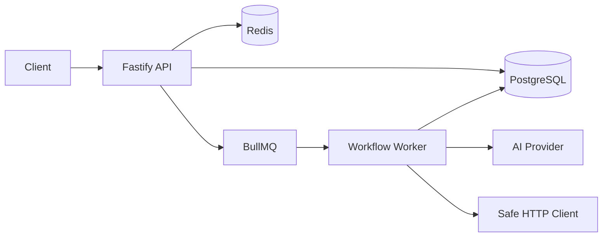
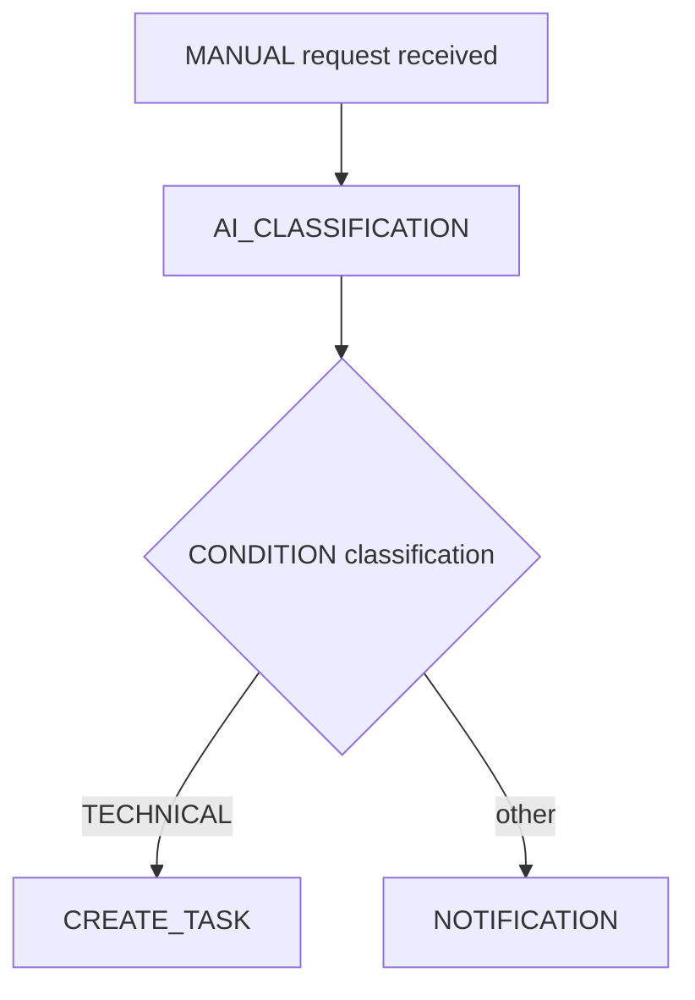

# FlowPilot AI

## Problem

Business processes often live across inboxes, spreadsheets, manual approvals, and fragile integrations. FlowPilot AI demonstrates how to model and execute these processes with a production-shaped backend architecture.

## Solution

FlowPilot AI is a multi-tenant workflow automation platform. Organizations define workflows with steps such as manual pass-through, AI classification, conditions, HTTP calls, task creation, and notifications.

## Architecture



The system is a modular monolith. PostgreSQL is the source of truth. Redis powers BullMQ. The API creates executions and the worker processes them asynchronously.

## Core Features

- JWT authentication with refresh token rotation.
- RBAC with `ADMIN`, `MANAGER`, and `MEMBER`.
- Organization-level multi-tenancy.
- Workflow definition and activation.
- Snapshot-based workflow versioning.
- Asynchronous execution with BullMQ.
- Idempotent execution creation.
- Safe HTTP integration step with SSRF protections.
- Mock AI provider abstraction.
- Conditional branching with a small DSL.
- Task management.
- Audit logs.
- Prometheus-style metrics.
- Health and readiness endpoints.
- Swagger/OpenAPI documentation.

## Tech Stack

Node.js, TypeScript, Fastify, PostgreSQL, Prisma, Redis, BullMQ, Zod, Vitest, Docker, Docker Compose, OpenAPI, Prometheus metrics, OpenTelemetry base.

## How It Works

1. A user authenticates and receives an access token.
2. The user creates a workflow and steps.
3. The workflow is validated and activated.
4. An execution request creates a `PENDING` execution with a workflow snapshot.
5. BullMQ enqueues the execution.
6. The worker processes steps and persists each result.
7. The execution finishes as `SUCCESS` or `FAILED`.

## Workflow Example



## Project Structure

```text
src/
  modules/
    auth/
    users/
    workflows/
    executions/
    tasks/
    integrations/
    audit/
  infrastructure/
    ai/
    database/
    http/
    notifications/
    observability/
    queue/
    redis/
  shared/
```

## Getting Started

```bash
npm install
cp .env.example .env
docker compose up -d postgres redis
npm run prisma:migrate
npm run prisma:seed
npm run dev
```

In another terminal:

```bash
npm run worker
```

Demo credentials:

```text
Email: admin@flowpilot.local
Password: demo-password
```

## Environment Variables

See `.env.example`. Secrets must never be committed. `JWT_SECRET` must be long and random outside local development.

## Docker

Run the full stack:

```bash
docker compose up --build
```

Services:

- `api`
- `worker`
- `postgres`
- `redis`

## Database Migrations

```bash
npm run prisma:migrate
npm run prisma:generate
```

## Tests

```bash
npm run lint
npm run typecheck
npm test
npm run coverage
npm run build
npm audit --audit-level=moderate
```

Coverage is useful, but it does not guarantee quality by itself. The current automated threshold is intentionally modest and should rise as more database-backed and worker integration tests are added. The project already focuses tests on critical rules: auth, branching, validation, URL safety, and helpers.

## API Documentation

Swagger is available when `ENABLE_SWAGGER=true`:

```text
http://localhost:3333/docs
```

REST Client examples live in `docs/api/flowpilot.http`.

## Observability

- `/health`: liveness.
- `/ready`: PostgreSQL and Redis readiness.
- `/metrics`: Prometheus-compatible metrics.
- Structured logs include request IDs and contextual IDs when available.

## Security

Security details and the threat model live in `SECURITY.md`.

## Architecture Decisions

ADRs live in `docs/adr/`.

## Trade-offs

- Modular monolith keeps delivery fast but does not provide independent deploys per module.
- Snapshot versioning duplicates JSON but preserves execution history clearly.
- Offset pagination is simple but not ideal for very large offsets.
- No runtime workflow cache yet; consistency is preferred over premature optimization.
- No access token blacklist; access tokens are short-lived and logout revokes refresh tokens.

## Current Limitations

- No UI.
- No real email/Slack/WhatsApp provider.
- No real AI provider by default.
- No MFA, OAuth, SSO, or API keys.
- SSRF protection is initial and should be reinforced with network policies in production.

## Roadmap

- Add real AI provider behind `AIProvider`.
- Add email/Slack notification providers.
- Add durable tracing exporter configuration.
- Add cache for active workflow definitions if read pressure justifies it.
- Add richer permission model only if roles become insufficient.
