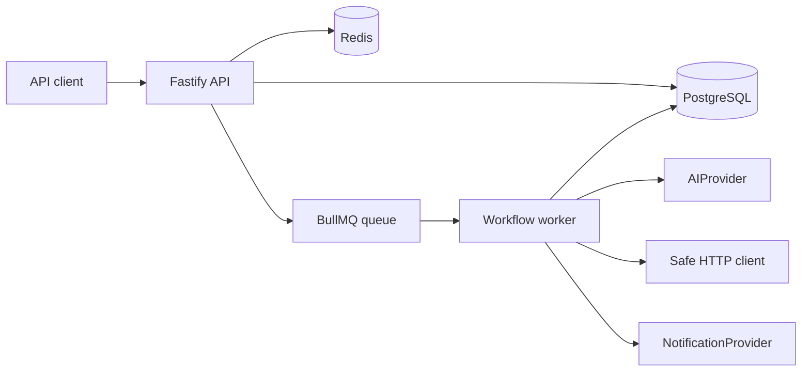

# Architecture Overview

FlowPilot AI is a modular monolith for multi-tenant workflow automation.

The API owns authentication, RBAC, REST endpoints, validation, and enqueueing. The worker owns asynchronous execution. PostgreSQL is the source of truth. Redis backs BullMQ and is not the source of truth for idempotency.

## API Versioning

All product endpoints live under `/api/v1`. Operational endpoints are `/health`, `/ready`, `/metrics`, and `/docs`.
