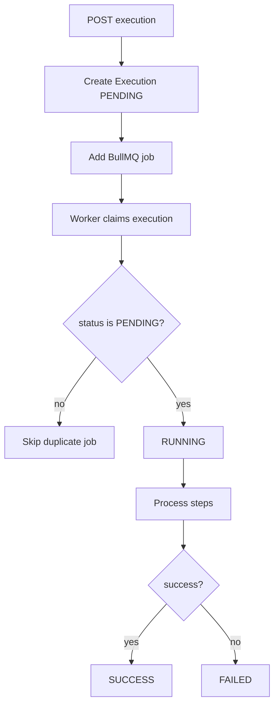

# Queue Processing

BullMQ processes `workflow-executions` jobs.

Retries are limited to three attempts with exponential backoff. The engine protects against duplicate processing by requiring the execution to still be `PENDING` before it can transition to `RUNNING`.
