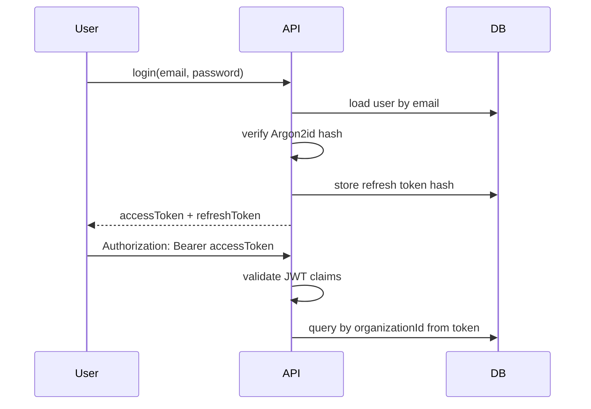

# Security Architecture

The main trust boundary is between the authenticated identity and organization-scoped resources. Client-provided `organizationId` values are never trusted for protected resource access.
