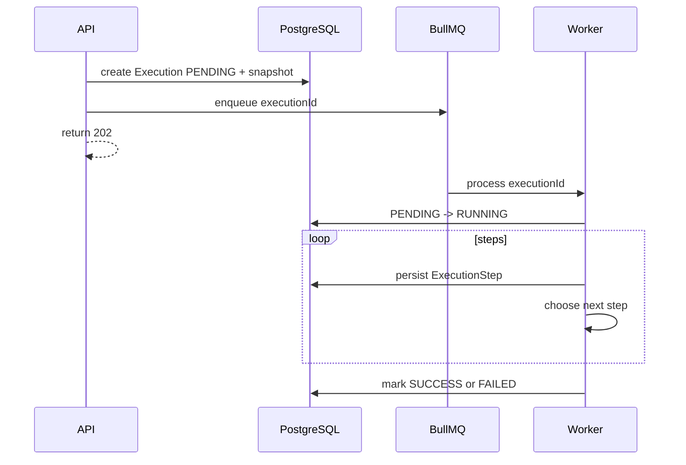

# Workflow Engine

Workflow definitions are stored as `Workflow` and `WorkflowStep`. Executions store `workflowVersion` and a `workflowSnapshot` so old executions preserve the exact definition they used.

Branching is intentionally simple. A step can declare `nextStepId`, and `CONDITION` can return either `onTrue` or `onFalse`. There is no arbitrary code execution and no JavaScript `eval`.
